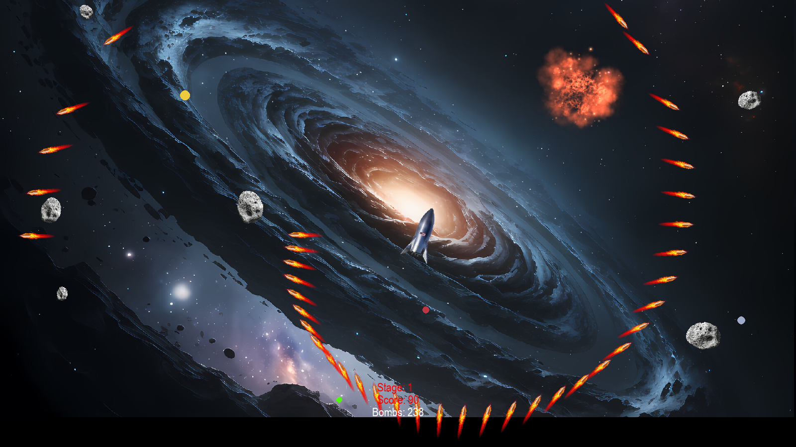

# Asteroids Game in Python



## Description
Le jeu Asteroids est un projet Python qui recrée le célèbre jeu d'arcade dans lequel le joueur commande un vaisseau spatial devant éviter et détruire des astéroïdes tout en naviguant dans l'espace. Ce projet a été développé par Eric Marchand et est entièrement open-source.


## Installation
Pour jouer à Asteroids, suivez ces instructions détaillées.

### Prérequis
- Assurez-vous d'avoir Python installé sur votre système en tapant dans un terminal :
```bash
  python --version
```
sinon téléchargez-le depuis [python.org](https://www.python.org/downloads/).
- Git doit être installé pour cloner le dépôt, vérifiez en tapant dans un terminal :
```bash
  git --version
```
sinon téléchargez-le depuis [git-scm.com](https://git-scm.com/downloads).

### Cloner le dépôt
Pour obtenir le projet, utilisez la commande suivante :
```bash
git clone https://github.com/stakepoolplace/asteroids.git
cd asteroids
```

### Configuration de l'environnement
Il est recommandé d'utiliser un environnement virtuel pour installer les packages requis pour éviter tout conflit avec d'autres projets ou configurations système.

Pour créer et activer un environnement virtuel, exécutez :
```bash
python -m venv venv
source venv/bin/activate  # On Unix or MacOS
venv\Scripts\activate  # On Windows
```
### Installation des dépendances
Ce projet dépend de plusieurs packages Python, qui sont listés dans le fichier `requirements.txt`. Installez-les en utilisant pip :
```bash
pip install -r requirements.txt
```
## Lancement du jeu
Après avoir installé toutes les dépendances, vous pouvez lancer le jeu en exécutant :
```bash
python asteroid.py
```

## Contribuer
Ce projet est open-source et les contributions sont les bienvenues. Si vous souhaitez contribuer au projet, vous pouvez forker le dépôt, apporter vos modifications et soumettre une pull request.

## Auteur
**Eric Marchand**

## Licence
Ce projet est open-source sous licence MIT. Voir le fichier `LICENSE` pour plus de détails.

